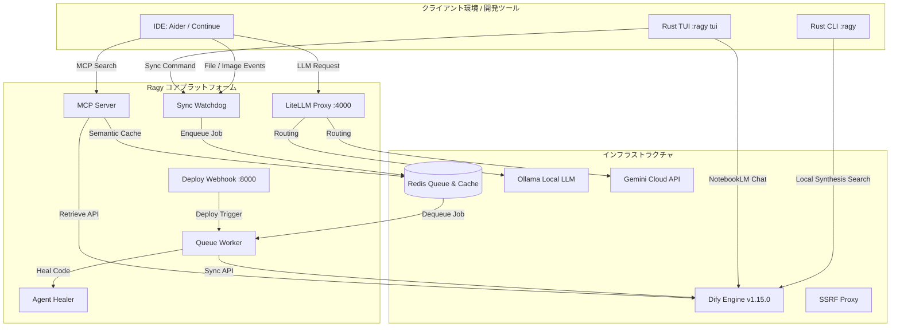

# Ragy: Enterprise-Ready Local-First Hybrid AI RAG & Agentic Platform

[](https://github.com/Morishita-mm/My-RAG-Agent-System/releases/tag/v2.2.3)
[](LICENSE)
[]()
[]()

「実用性と堅牢性の極限の両立」をテーマに設計された、**エンタープライズ向けのローカルファースト型ハイブリッドRAG＆自律AIエージェントプラットフォーム**です。

コア CLI & 豪華な TUI（Terminal User Interface）を **Rust** でフルスクラッチ開発し、高速性とポータビリティを実現。バックエンドにはオープンソースのLLMアプリプラットフォーム **Dify** を核に、クラウドモデル（Gemini 3.5 / 2.5 Flash）とローカルLLM（Ollama Qwen2.5-Coder）を透過的に統合。

さらに、SSRF防壁、次世代のMCP (Model Context Protocol)、定量的自動評価CI/CDループ、エラー検知時のコード自己修復機能までを備え、ポートフォリオ・プロダクションの双方で極めて実用性の高いAIインフラストラクチャを提供します。

---

## 🏗️ System Architecture (システム構成図)



---

## ✨ Key Features (主要機能)

### 1. 🚀 Rust-powered Terminal Interface (NotebookLM風 TUI)

* Rust（`ratatui` + `crossterm`）で実装された豪華なターミナルダッシュボードを搭載。
* **NotebookLM風 RAG チャットパネル**: 選択されたアクティブプロジェクトと、Difyナレッジベース、ローカルLLM Proxyをシームレスに繋ぐチャット対話インターフェース。
* **リアルタイム統計・キャッシュ管理**: Redisキャッシュのヒット率、Exact/Semanticキャッシュの保持件数のモニタリングや、キー1つでのRedisキャッシュパージ。
* **高精度な日本語スクロール表示**: 全角・半角混在テキストの折返しをリアルタイム計算し、1行単位で正確にVimキー（j/k）スクロール・自動スクロール追従が可能なバッファロジックを自作。

### 2. 🧠 Context Optimization (Lost in the Middle 対策)

* 長いコンテキストの「最初と最後」に最も注意を払い、「中盤」を軽視しやすいLLMの性質を克服するアルゴリズムを標準搭載。
* Difyから取得したセグメント群をスコア順にソートし、高スコアのドキュメントを先頭と末尾に、低スコアのものを中間に配置（`[Rank 1, Rank 3, Rank 5, Rank 4, Rank 2]`）。
* このコンテキスト最適化は、Python (MCP/CLI) および Rust (TUI) の両システムに同一仕様で適用され、回答の事実性を極限まで高めます。

### 3. 🖼️ Multimodal Document Parsing (Vision OCR標準化)

* テキスト、`.pdf`（スキャンPDF含む）、`.docx`、`.xlsx` の自動マークダウン変換に加え、**`.png`, `.jpg`, `.jpeg` などの画像ファイルを直接サポート**。
* Pillow（PIL）および LiteLLM Vision API を介し、システム構成図やUML、スクリーンショットなどの図表から高精度なMarkdown構造化テキストを自律生成してDifyへアップロード・同期。

### 4. 🧪 Automated Quantitative Evaluation (定量的RAG自動評価)

* RAGシステムの精度をコミット単位で保証するため、**定量的評価モデルを CI/CD テストループへ統合**。
* テスト用正解データセット (`tests/evaluation_dataset.json`) の質問に対し、LLM（Gemini）が回答を `Perfect` (+1.0), `Acceptable` (+0.5), `Missing` (0.0), `Incorrect` (-1.0) の4段階で厳格アサート。
* 評価結果レポート（Markdown）と時系列メトリクス（CSV）を自動追記・生成（`~/agents/reports/`）。

### 5. 🛠️ Self-Healing Code Agents (`agent_healer.py`)

* 本番・監視ログから例外（Traceback）を検知すると自律エージェントが起動。
* ソースコードを抽象構文木（AST）レベルで解析し、原因箇所を特定。自動的に修正パッチを適用してGitHubのPull Requestまでを人間を介さず全自動で発行。

---

## 🛠️ ragy コマンドリファレンス (CLI ＆ TUI 使い方)

Rustで記述された統合バイナリ `ragy` は、開発からインフラのライフサイクル、TUI起動まですべてを1コマンドで制御します。

| コマンド | 引数/オプション | 概要 |
| :--- | :--- | :--- |
| **`ragy start`** | - | インフラ（Ollama, Docker Compose、同期 Watchdog、Queue Workerなど）を順序制御付きで一括起動します。 |
| **`ragy stop`** | - | 全てのバックグラウンドプロセスと Docker コンテナをクリーンに停止します。 |
| **`ragy restart`** | - | ポート競合のデッドロックを防止するポーリング処理を含め、システムを一括で安全再起動します。 |
| **`ragy status`** | `--detail`, `--docs` | 各種サーバー（Ollama, Redis, LiteLLM, Difyなど）のヘルス、Watchdog、キューワーカー、ドキュメントの同期ステータスを表示。 |
| **`ragy init`** | `<dataset_id>` | 実行したカレントディレクトリのプロジェクト名を決定し、`.rag-project` 設定ファイルを自動生成、さらにdocsのシンボリックリンクを作成。 |
| **`ragy sync`** | - | カレントディレクトリに紐づくローカル文書（画像含む）を、Difyの対応データセットへ即時手動同期。 |
| **`ragy tui`** | - | **NotebookLM型ターミナルチャットダッシュボード**を即座に起動します。 |

### `ragy status` の実行例

```bash
$ ragy status --docs
=== RAG System Status ===
Ollama          : RUNNING (127.0.0.1:11434)
Redis           : RUNNING (127.0.0.1:6379)
LiteLLM Proxy   : RUNNING (127.0.0.1:4000)
Dify Gateway    : RUNNING (127.0.0.1:8080)
Sync Watchdog   : RUNNING
Deploy Listener : RUNNING
Queue Worker    : RUNNING
Ngrok Tunnel    : STOPPED

=== Synced Documents Status ===
- docs/My-GitHub-RAG/summary.md: SYNCED
- docs/My-GitHub-RAG/rag_system_architecture.md: SYNCED
- docs/My-GitHub-RAG/architecture_diagram.png: SYNCED (Parsed via Vision LLM)
```

---

## 🚀 クイックスタート (インストールとセットアップ)

### 1. グローバル共通環境の設定

システム全体で共通利用する Dify API やモデルの設定ファイルを配置します。

```bash
mkdir -p ~/.ragy
cat <<EOF > ~/.ragy/env
# Ragy Global Configuration
DIFY_API_BASE="http://localhost:8080/v1"
RAGY_LLM_MODEL="gemini-2.5-flash"
RAGY_RERANK_ENABLE="true"
EOF
```

### 2. クローンとビルド、インフラの起動

```bash
git clone https://github.com/Morishita-mm/My-RAG-Agent-System.git
cd My-RAG-Agent-System

# .env ファイルの準備（APIキーなど）
cp envs/middleware.env.example .env

# Rust 実行ファイルのビルド（※ /usr/local/bin への登録推奨）
cargo build --release
cp target/release/ragy ./ragy

# システム全体の起動
./ragy start
```

### 3. 各プロジェクトでの初期化と TUI RAG チャット

```bash
# 対象のプロジェクトディレクトリへ移動
cd ~/src/github.com/Morishita-mm/Lissue

# DifyデータセットIDを指定して初期化（.rag-projectが自動作成されます）
ragy init d42ec795-1e17-4ced-8efa-8996e479ae23

# RAG TUIの起動
ragy tui
```

---

## 📖 開発者向け詳細ドキュメントリンク

さらに詳しいアーキテクチャの背景や設計については、以下の内部ドキュメントを参照してください。

* [1. Getting Started (環境構築ガイド)](./guides/01_getting_started.md)
* [2. Development Workflow (開発フローと同期)](./guides/02_development_workflow.md)
* [3. Engineering Hacks (技術的なこだわり)](./guides/03_engineering_hacks.md) - **※macOS制限の突破、Lost in the Middle対策、Rust TUI ハックなどの詳細が載っています**
* [4. Dify Search Optimization Guide (検索・リランク最適化)](./docs/dify_search_optimization_guide.md)

---

## 📊 ログとオブザーバビリティ (デバッグ)

チャットリクエストがうまく届かない、回答の整合性を確かめたいなどのトラブルシューティング時は、以下のログファイルが即時に役立ちます。

* **`logs/tui_debug.log`**:
  TUIで行われたすべての RAG 対話の、Dify Retrieval API 生レスポンス（セグメント、スコア）、LiteLLMへの全プロンプト、LLM生返答を記録。
* **`logs/sync_docs.log`**:
  画像、Word、Excelなどのドキュメントが watchdog によって検知され、非同期でDifyへパース＆アップロードされる同期イベントを記録。
* **`logs/worker.log`**:
  Redisにキューイングされたタスクの、キューワーカーによる非同期並列実行トレースを記録。

---

## 👨‍💻 作者

**Morishita-mm**

* GitHub: [@Morishita-mm](https://github.com/Morishita-mm)
* Theme: 「実用性と堅牢性の極限の両立」

