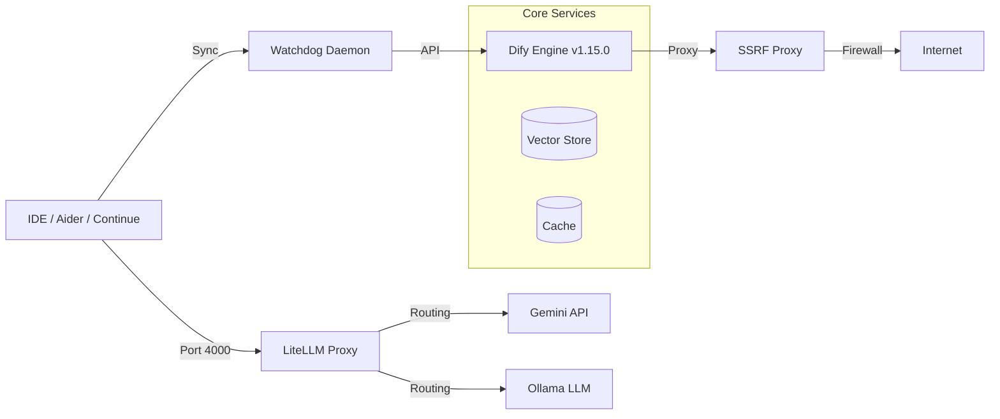

# Ragy: Local-First Hybrid AI RAG & Agentic Platform

[](https://github.com/Morishita-mm/My-RAG-Agent-System/releases/tag/v1.1.0)
[](LICENSE)
[]()

「実用性と堅牢性の極限の両立」をテーマに設計された、エンタープライズ対応のローカルファースト型ハイブリッドRAG＆自律AIエージェントプラットフォームです。

オープンソースのLLMアプリ開発プラットフォームである **Dify** を核に、クラウドモデル（Gemini 3.5 Flash）とローカルLLM（Ollama Qwen2.5-Coder）を透過的に統合。さらに、SSRF防壁、次世代のMCP (Model Context Protocol)、エラー検知時の自己修復機能までを備えた、モダンなAIインフラストラクチャパッケージです。

## 🏗️ System Architecture



## ✨ Key Features

1. **Hybrid LLM Routing (`LiteLLM`):** 推論タスクはGemini、ローカルのコード生成はOllama（Qwen2.5-Coder）へ自動ルーティング。ポート `:4000` でOpenAI互換APIとして統合。
2. **Real-time RAG Sync (`watchdog`):** 指定ディレクトリのMarkdownを監視し、Difyのナレッジベースと自動同期。設定ファイルのホットリロードにも対応。
3. **MCP Integration:** ローカルコンテキストをLLMに接続するMCPサーバーを標準搭載。Valkey/Redisを用いたセマンティックキャッシュで応答速度を極限まで最適化。
4. **Self-Healing Agents (`agent_healer.py`):** ログのTraceback（例外）を検知し、AIが自律的にコードを修正してGitHub PRまで自動作成する自己修復パイプライン。
5. **SSRF Hardening:** Squidプロキシによる外部アクセス制限で、Dify Sandbox等からのローカルインフラへの不正アクセスを完全遮断。

## 📖 Documentation

システムの詳細なセットアップや運用フローについては、以下のガイドを参照してください。

* [1. Getting Started (環境構築ガイド)](https://github.com/Morishita-mm/My-RAG-Agent-System/blob/main/guides/01_getting_started.md)
* [2. Development Workflow (開発フローと同期)](https://github.com/Morishita-mm/My-RAG-Agent-System/blob/main/guides/02_development_workflow.md)
* [3. Engineering Hacks (技術的なこだわり)](https://github.com/Morishita-mm/My-RAG-Agent-System/blob/main/guides/03_engineering_hacks.md)

## 🚀 Quick Start

```bash
# 1. 共通設定の作成
mkdir -p ~/.ragy
echo 'DIFY_API_BASE="http://localhost:8080/v1"' > ~/.ragy/env

# 2. 起動
git clone [https://github.com/Morishita-mm/My-RAG-Agent-System.git](https://github.com/Morishita-mm/My-RAG-Agent-System.git)
cd My-RAG-Agent-System
./ragy start

```

## 👨‍💻 Author

**Morishita-mm**

