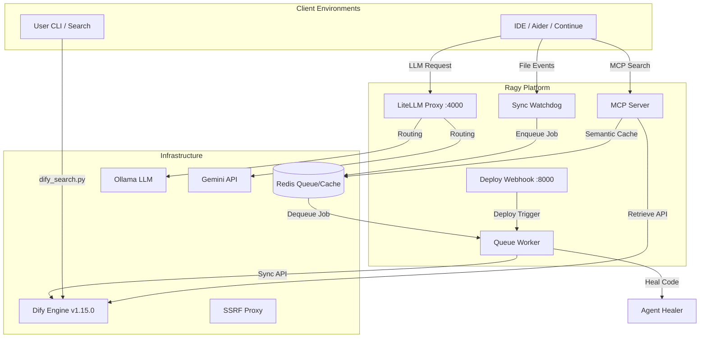

# Ragy: Local-First Hybrid AI RAG & Agentic Platform

[](https://github.com/Morishita-mm/My-RAG-Agent-System/releases/tag/v1.1.0)
[](LICENSE)
[]()

「実用性と堅牢性の極限の両立」をテーマに設計された、エンタープライズ対応のローカルファースト型ハイブリッドRAG＆自律AIエージェントプラットフォームです。

オープンソースのLLMアプリ開発プラットフォームである **Dify** を核に、クラウドモデル（Gemini 3.5 Flash）とローカルLLM（Ollama Qwen2.5-Coder）を透過的に統合。さらに、SSRF防壁、次世代のMCP (Model Context Protocol)、エラー検知時の自己修復機能までを備えた、モダンなAIインフラストラクチャパッケージです。

## 🏗️ System Architecture



## ✨ Key Features

1. **Hybrid LLM Routing (`LiteLLM`):** 推論タスクはGemini、ローカルのコード生成はOllama（Qwen2.5-Coder）へ自動ルーティング。ポート `:4000` でOpenAI互換APIとして統合。
2. **Asynchronous RAG Sync (`watchdog` & `Redis`):** ファイル変更イベントを `watchdog` で検知し、Redisキューを介して非同期的にDifyナレッジと同期。ワーカープロセスによる安全な非同期並列実行に対応。
3. **Dynamic Project Isolation (`.rag-project`):** 優先順位（Gitリポジトリ名 ＞ カレントディレクトリ名 ＞ 環境変数）に従い、カレントディレクトリに紐付くプロジェクト名を自動決定。プロジェクト内の `.rag-project` を最優先で読み込み、適切なDifyナレッジを分離して検索・同期。
4. **MCP Integration:** ローカルコンテキストをLLMに接続するMCPサーバーを標準搭載。Valkey/Redisを用いたセマンティックキャッシュで応答速度を極限まで最適化。
5. **Self-Healing Agents (`agent_healer.py`):** ログのTraceback（例外）を検知し、AIが自律的にコードを修正してGitHub PRまで自動作成する自己修復パイプライン。
6. **SSRF Hardening:** Squidプロキシによる外部アクセス制限で、Dify Sandbox等からのローカルインフラへの不正アクセスを完全遮断。

## 📖 Documentation

システムの詳細なセットアップや運用フローについては、以下のガイドを参照してください。

* [1. Getting Started (環境構築ガイド)](https://github.com/Morishita-mm/My-RAG-Agent-System/blob/main/guides/01_getting_started.md)
* [2. Development Workflow (開発フローと同期)](https://github.com/Morishita-mm/My-RAG-Agent-System/blob/main/guides/02_development_workflow.md)
* [3. Engineering Hacks (技術的なこだわり)](https://github.com/Morishita-mm/My-RAG-Agent-System/blob/main/guides/03_engineering_hacks.md)

## 🚀 Quick Start

```bash
# 1. 共通設定の作成
mkdir -p ~/.ragy
echo 'DIFY_API_BASE="http://localhost:8080/v1"' > ~/.ragy/env

# 2. 起動
git clone https://github.com/Morishita-mm/My-RAG-Agent-System.git
cd My-RAG-Agent-System
./ragy start

# 3. 各自のプロジェクトディレクトリで初期化
# 例：対象データセットのIDを指定して初期化を実行
# カレントディレクトリに応じた「.rag-project」が自動生成されます
cd ~/path/to/your/project
/path/to/My-RAG-Agent-System/ragy init <dataset_id>

# 4. 同期と検索
# 変更監視 watchdog 経由で自動同期されるほか、手動同期や検索も可能
/path/to/My-RAG-Agent-System/ragy sync
python3 /path/to/My-RAG-Agent-System/scripts/dify_search.py "検索クエリ"
```

## 👨‍💻 Author

**Morishita-mm**

