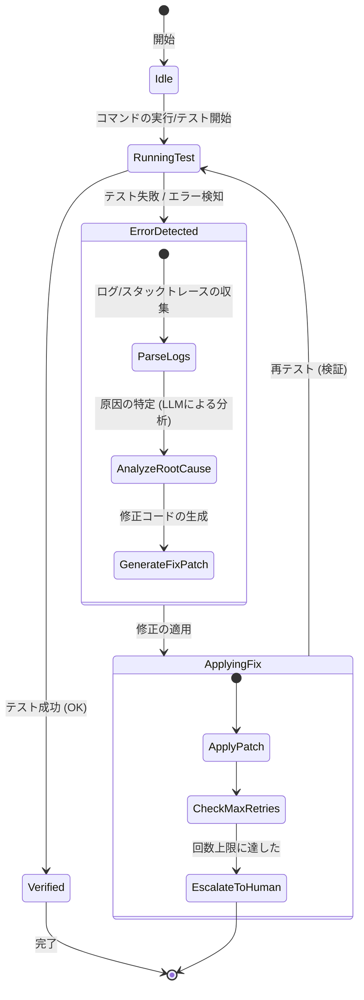

# 自己修復ワークフロー設計書 (Auto-Fix Workflow)

本ドキュメントは、AI エージェントが開発時に発生するエラーを自動的に検知、分析、修復、および再検証するための自律的プロセスの設計を示すものです。

---

## 1. 概要

自己修復ワークフローの目的は、AI エージェントが人間の開発者の介入を最小限にしつつ、コードの欠陥（コンパイルエラー、単体テストの失敗、Linter警告）を安全かつ迅速に自動修復することです。このワークフローは、エラー検知、原因分析、修正の適用、および再検証の4つの主要フェーズから構成されます。

---

## 2. 状態遷移とライフサイクル

---

## 3. 各フェーズの詳細

### 3.1 エラー検知 (Error Detection)
- **トリガー**: テストスクリプト (`python3 -m unittest` 等) またはビルドコマンドの終了コードが非ゼロ (Non-zero exit code) の場合にプロセスが作動します。
- **入力情報**: 
  - 実行されたコマンドライン
  - 標準出力 (stdout) および標準エラー出力 (stderr)
  - 影響を受けたファイル一覧

### 3.2 原因分析 (Root Cause Analysis)
- エージェントは、エラーログから「スタックトレースの最下部（例外名、ファイル名、行数）」を抽出します。
- LLM プロンプトに以下のコンテキストをロードし、原因を診断させます：
  1. 該当箇所のソースコード周辺（前後20行）
  2. エラーメッセージおよび型情報
  3. 依存ライブラリのバージョンやインポート状況
- **分析の出力**: 修正が必要なファイル名、修正対象のコード、新しいコードの差分 (Diff)。

### 3.3 自動修復と適用 (Applying Fixes)
- コードエディットツール (`replace_file_content` や `multi_replace_file_content`) を呼び出し、分析された差分を自動的にコードに適用します。
- **制約**: バージョン管理（Git）で作業中以外のファイルは汚染しないように適用範囲を最小限に留めます。

### 3.4 再検証とループ制御 (Verification & Loop Control)
- 修正適用後、再度 `RunningTest` に戻り、同じテストスイートを実行します。
- **リトライ制限**: 無限ループを防ぐため、**最大リトライ回数を 3回** に制限します。
- **エスカレーション**: 3回のリトライでも解決しない場合は、自動適用を停止し、エラーログのサマリーを添付した上で、人間に判断をエスカレーションします。

---

## 4. エッジケースと回避策

- **無限ループの防止**: 同一箇所の修正でエラー内容が変わらない場合、あるいは状態が循環する場合はリトライカウントに関わらず即座に停止します。
- **Git ロールバックの活用**: 修正の適用によってエラーが急増または悪化したと判定された場合、`git checkout` で修正前のコミット状態にロールバックし、別のアプローチで修正を試みます。
